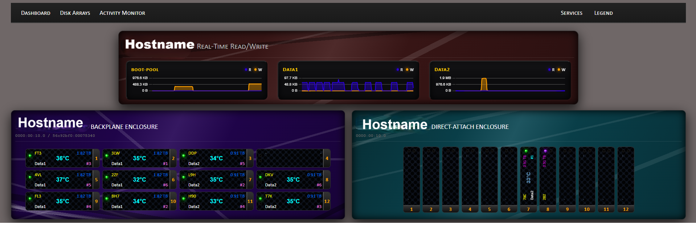

# TrueNAS Scale Drive-Bay Dashboard
**version 20.4**


A self-hosted dashboard that visualizes TrueNAS Scale drive layout, status, and activity in a chassis-style view.



---

## Why?
* **No Chassis:** I don't have a dedicated disk storage chassis.
* **UI Gaps:** TrueNAS Scale (Community Edition) lacks a dashboard widget that visually shows drive status.
* **Laziness is a Virtue:** Tracing a specific drive in TrueNAS is a long and involved process. I wanted a shortcut.
* **Blinky Lights:** I like them. Simple as that.
* **Home Lab Life:** My lab is just that—a lab. There are wires everywhere and the system is cobbled together from old PCs and servers. I prefer playing with the tech over making it "perfect."

And then there's the whole $$$ thing. If I could afford a 45Drives Storinator or a secondhand disk storage chassis, I’d be using it—but I would still want the blinky lights. I am Gen X, after all.

---

## What Does It Do?
This script generates a virtual Drive Storage Chassis dashboard. It displays:

* **Physical Arrangement:** Shows drives as detected by the HBA and the specific breakout cables attached (since I don't have a backplane).
* **Identification:** Displays formatted Drive Capacity and the **last 3 digits of the drive serial number** (I label my physical disks this way for easy tracing).
* **Activity:** Real-time read/write activity via a blue "blinky" LED.
* **Status Indicators:**
    * **Green:** Drive is connected, and TrueNAS reports it is functioning normally.
    * **Green [Blinking]** Drive is connected but TrueNAS is reporting *OFFLINE*
    * **Orange:** Drive is connected, but TrueNAS is reporting error(s).
    * **Silver:** Drive is connected and currently resilvering.
    * **Red:** Drive is connected, but marked Offline by TrueNAS.
    * **Purple:** Drive is connected but is a spare or unallocated.
    * **Purple/Orange [Blinking]** Drive is connected and unallocated, but TrueNAS reports an error.
    * **Purple/Red [Blinking]** Drive is connected and unallocated, but TrueNAS reports faulted.

---

## Key Features
* **Live Configuration Menus:** Adjust chassis layout, bay appearance, fonts, colors, and chart options directly in the UI.
* **Instant Preview:** Most styling changes (including bay height) update live without a service restart.
* **Per-Device Overrides:** Device-specific settings stored in `config.json` under each PCI address.
* **Flexible Layout:** Configure rows and bays-per-row, with empty bay placeholders when the grid exceeds detected drives.
* **Activity Monitor:** Optional per-pool read/write charts with smooth updates and compact card layout.
* **Resilient Config:** Auto-generates `config.json` if missing and falls back to hardened defaults if malformed.

---

## Installation

1.  **SSH into the TrueNAS Scale console.**
2.  **Create a directory on one of your Pools:**
    ```bash
    mkdir -p /mnt/[Pool_Name]/scripts/dashboard
    ```
3.  **Navigate to the folder:**
    ```bash
    cd /mnt/[Pool_Name]/scripts/dashboard
    ```
4.  **Upload Files:** Use WinSCP or your preferred file transfer tool, to copy all of the files in the dashboard folder from this repository, into this folder on your TrueNAS server.
5.  **Set Permissions:**
    ```bash
    chmod +x /mnt/[Pool_Name]/scripts/dashboard/service.py
    chmod +X /mnt[Pool_Name]/scripts/dashboard/start_up.sh
    ```
6.  **Run the Service Manually (for testing):**
    ```bash
    ./start_up.sh
    ```
    If successful you will see the following output
    ```
    Stopping any existing service...
    Clearing __pycache__ directories...
    (re)starting the service...
    ```
7.  **Verify the Service:**
    ```bash
    ps aux | grep service.py
    ```
    You should see two entries similat to below:
    ```
    root      366525  4.9  0.1 248916 19788 pts/0    Sl   17:59   0:45 python3 service.py
    root      369663  0.0  0.0   3880  1384 pts/0    S+   18:14   0:00 grep service.py
    ```
    
     The first is the running script; the second is your search command (`grep`). If you only see the `grep service.py` entry, the service failed to start.

8.  **Stop the Service (if needed):**
    ```bash
    pkill -9 -f service.py
    ```

9.  **Set up Automation:**
    To ensure the dashboard starts automatically, go to the TrueNAS Web UI:
    * Navigate to **System Settings > Advanced > Init/Shutdown Scripts**.
    * Click **Add**.
    * **Description:** `Disk Status Service`
    * **Type:** `Script`
    * **Script:** `python3 /mnt/[Pool_Name]/scripts/dashboard/start_up.sh`
    * **When:** `Post Init`
    * **Save.**

---

## What do the files do?
### `start_up.sh`
Stops the service on TrueNAS (if running), clears stale caches, and (re)launches the Python daemon.

### `service.py`
Main daemon that interrogates TrueNAS and your HBA to identify:
* Used ports
* Disk serial numbers
* Breakout slot positions (see **Logic**)
* Formatted disk capacity (not vdev capacity)
* Drive status and activity
* Pool names and drive-to-pool mapping

It also hosts the web dashboard on **port 8010** by default (configurable).

### `zfs_logic.py`
Helper logic for drive and pool discovery used by `service.py`.

### `app.js`
Client entry point that fetches `/data`, renders chassis and bays, and drives live updates.

### `MenuSystem.js`
Builds the configuration menus, handles input, previews changes, and saves to `config.json`.

### `Chassis.js`
Generates chassis markup and container layout for each device.

### `Bay.js`
Generates bay markup for each drive slot.

### `DiskInfo.js`
Formats disk metadata (capacity, pool, serial, index) for display.

### `LEDManager.js`
Maps disk states to LED classes for consistent status colors.

### `ActivityMonitor.js`
Fetches pool activity data and renders the read/write charts.

### `index.html`
Static HTML shell that loads the dashboard scripts and styles.

### `style.css`
Base styling for overall layout and global theme variables.

### `Base.css`
Common typography and shared UI styling.

### `Chassis.css`
Styling for chassis containers and layout framing.

### `Bay.css`
Styling for bays, including size, grill pattern, and labels.

### `LEDs.css`
LED indicator styles and animations.

### `Menu.css`
Menu layout and form control styling.

### `ActivityMonitor.css`
Styles for the activity monitor cards and charts.

### `livereload.js`
Optional dev helper for auto-refresh during local development.

### `config.json`
Primary configuration store, auto-generated on first run if missing.

### `config.json.backup`
Local backup copy of the configuration (optional).

### `CONFIG_GUIDE.md`
Detailed reference for configuration keys and examples.

### `CUSTOMIZATION_GUIDE.md`
Tips for theming, fonts, colors, and layout tweaks.

### `Developer_Notes.md`
Implementation notes and internal architecture notes.

### `CHANGELOG.md`
Version history and feature highlights.

### `LICENSE`
Project license.

### `image.png`
README screenshot (you will update this).

### `.gitignore`
Git ignore rules for generated and local-only files.

### `__pycache__/`
Python bytecode cache directory (generated at runtime).

---

## Logic
The logic now builds the layout dynamically from what TrueNAS reports:
* **Controller discovery:** Scans `/dev/disk/by-path` for PCI-based storage controllers and skips virtual/emulated controllers.
* **Capacity detection:**
  * If an enclosure/backplane is detected under `/sys/class/enclosure`, the slot count is used as the bay capacity.
  * If no backplane is found, it falls back to SAS phy counts or vendor tools (sas2ircu/sas3ircu/storcli) to estimate direct-attach capacity.
  * Capacity can be overridden in `config.json` per controller (ports, lanes, max_bays).
* **Bay numbering:** Each disk path is parsed for tokens like `phy`, `ata`, `sas`, `port`, `slot`, or `exp` followed by a number, which becomes the bay index.
* **Layout vs hardware:** Rows and bays-per-row are display settings. They do not change the detected bay count, only how the grid is drawn.

> **[NOTE]**
> Without a backplane, physical slot order is inferred from the by-path naming. If your cable order does not match the displayed order, swap SATA connectors or adjust layout settings.

---
## Configuration System

The dashboard is controlled by a central `config.json` file. This file dictates everything from the HBA hardware address to the specific hex codes for drive status LEDs.

### How it Works
- **On First Run**: If the script does not find `config.json` in its directory, it will automatically generate one with standard settings (16-bay single chassis, 8010 port, standard colors).
- **Live Updates**: You do not need to restart the service to change settings. When you save changes to `config.json`, the dashboard detects the file-change timestamp and updates the UI for all connected users within 5 seconds.
- **Resilience**: The service is designed to be "always-up." If the config file is accidentally deleted or becomes corrupted (e.g., a typo in the JSON syntax), the service will immediately switch to internal "Hardened Defaults" to ensure you don't lose sight of your storage health.

> For information on what can be configured, read [CONFIG_GUIDE.md](https://github.com/iamawumpas/TrueNAS-Scale-Drive-Bay-Assignment/blob/main/CONFIG_GUIDE.md)
---

## Future Plans
* **Responsive Chassis Width:** Allow dynamic chassis width adjustment to better fit different screen sizes and preferences.
* **Visual Reordering:** Drag-and-drop bay rearrangement to customize logical order independent of physical HBA port mapping.
* **Extended Metrics:** Detailed per-drive latency tracking, temperature monitoring via SMART data, and predictive health metrics.
* **Mobile Responsive Design:** Optimize dashboard layout for smaller screens and mobile devices.