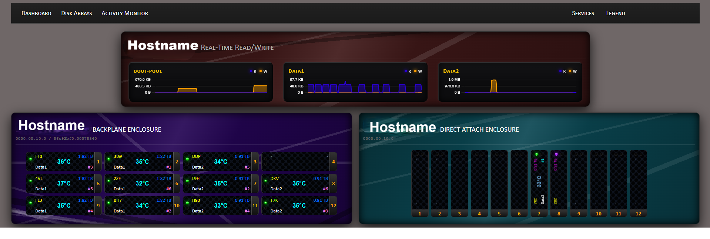

# TrueNAS Scale Drive-Bay Dashboard
**version v28.9**


## Documentation / Wiki

I've moved detailed installation, file-overview, startup, and configuration notes into the repo `WIKI/` folder so they can be copied to the GitHub wiki or used as standalone docs:

- [Installation](WIKI/Installation.md)
- [File Overview](WIKI/FileOverview.md)
- [start_up.sh details](WIKI/StartUp.md)
- [Python scripts overview](WIKI/PythonScripts.md)
- [Manual configuration & references](WIKI/ManualConfiguration.md)

Also see: [CONFIG_GUIDE.md](CONFIG_GUIDE.md), [CUSTOMIZATION_GUIDE.md](CUSTOMIZATION_GUIDE.md) (menu-first workflow + advanced manual overrides), and [CHANGELOG.md](CHANGELOG.md) for canonical references.


A self-hosted dashboard that visualizes TrueNAS Scale drive layout, status, and activity in a chassis-style view.


---

## System Requirements

**Primary Target:** TrueNAS Scale (recommended for TrueNAS API integration)

**Also Runs On:** Any Linux distribution with ZFS support (Ubuntu, Debian, Proxmox, etc.)

**File System:** ZFS is **required**. This project does NOT support other file systems (ext4, btrfs, LVM, etc.).

**Minimum Requirements:**
1. **Linux OS** (Ubuntu 20.04+, Debian 11+, Proxmox 7+, or equivalent)
2. **ZFS** installed and configured with at least one pool
3. **Python 3.6+** (no external pip dependencies)
4. **HTTP port available** (default 8010, configurable in `config.json`)

**Optional:**
- **TrueNAS middleware (`midclt`)** — enables native API integration on TrueNAS Scale (graceful fallback to `zpool` parsing if unavailable)
- **SES/Enclosure support** — automatically detected from `/sys/class/enclosure` if hardware supports it

---

## Why?
* **No Chassis:** I don't have a dedicated disk storage chassis.
* **UI Gaps:** TrueNAS Scale (Community Edition) lacks a dashboard widget that visually shows drive status.
* **Laziness is a Virtue:** Tracing a specific drive in TrueNAS is a long and involved process. I wanted a shortcut.
* **Blinky Lights:** I like them. Simple as that.
* **Home Lab Life:** My lab is just that—a lab. There are wires everywhere and the system is cobbled together from old PCs and servers. I prefer playing with the tech over making it "perfect."

And then there's the whole $$$ thing. If I could afford a 45Drives Storinator or a secondhand disk storage chassis, I’d be using it—but I would still want the blinky lights. I am Gen X, after all.

---

## What Does It Do?
This script generates a virtual Drive Storage Chassis dashboard. It displays:

* **Physical Arrangement:** Shows drives as detected by the HBA and the specific breakout cables attached (since I don't have a backplane).
* **Identification:** Displays formatted Drive Capacity and the **last 3 digits of the drive serial number** (I label my physical disks this way for easy tracing).
* **Activity:** Real-time read/write activity via a blue "blinky" LED.
* **Status Indicators (Allocated Disks):**
    * **Green:** Drive is healthy and functioning normally in a pool
    * **Green [Blinking]:** Drive is allocated but marked OFFLINE by TrueNAS
    * **Orange:** Drive has READ/WRITE/CHECKSUM errors but still functioning
    * **White:** Drive is currently resilvering/repairing/replacing
    * **Red:** Drive is FAULTED, UNAVAIL, REMOVED, or in a FAULTED/SUSPENDED pool

* **Status Indicators (Unallocated/Spare Disks):**
    * **Purple:** Healthy spare drive ready for use
    * **Purple/Orange [Blinking]:** Spare drive with READ/WRITE/CHECKSUM errors
    * **Purple/Red [Blinking]:** Spare drive is FAULTED, UNAVAIL, or REMOVED

* **Drive Information Panel:**
   * Disk Serial Number
   * Disk Capacity
   * Pool Name (that the disk belongs to)
   * Disk Position (in the pool)
   * Disk Temperature
     
* **Pool Activity Monitor:**
    * **Normal:** Real-time read/write activity charts for each pool
    * **DEGRADED Pool:** Orange "DEGRADED" overlay on chart (pool still functioning)
    * **FAULTED/SUSPENDED Pool:** Red box with "FAULTED" text replaces chart (pool I/O suspended)

* **TrueNAS Services Status:**
   * **Lists** all Autostart at Boot services and their status
   * Creates an **alert** if any of the services are Stopped
 
* **Alerts**
   * **Disk Temperature** > 40&degC
   * **Disk Fault/Error**
   * **Degraded Pool**
   * **TrueNAS Services** STOPPED
 
* **Github Updates**
   * ability to update the dashboard from the GUI instead of uploading the repo manually to the scripts folder
   * ability to repair/replace missing files from the scripts folder

---

## What's New in v28.9?

* **Right-Chassis Font-Style Live Preview Fix:** Improved per-device preview card resolution so font-style checkbox changes apply live on both enclosures consistently.
* **Font Slider Consistency Pass:** Normalized pixel-slider parsing/clamping so all font size sliders behave the same, including mixed-unit saved values.
* **Disk ID Font Scaling Alignment:** Updated Disk ID font-size capping to match the same cap path used by other bay text fields.
* **Empty-Field Artifact Removal:** Replaced `&nbsp;` placeholders with empty strings for missing bay info fields to prevent font-size-dependent artifact glyphs.
* **Release Metadata Synchronization:** Updated VERSION and changelog metadata to v28.9.

---

## Key Features
* **Live Configuration Menus:** Adjust chassis layout, bay appearance, fonts, colors, and chart options directly in the UI.
* **Instant Preview:** Most styling changes (including bay height) update live without a service restart.
* **Per-Device Overrides:** Device-specific settings stored in `config.json` under each PCI address.
* **Flexible Layout:** Configure rows and bays-per-row, with empty bay placeholders when the grid exceeds detected drives.
* **Activity Monitor:** Optional per-pool read/write charts with smooth updates and compact card layout.
* **Services Status Panel:** Auto-refreshing services table for auto-start services with stopped-service visual alerting.
* **Repository Sync Tools:** Menu controls for update checks, update install, and missing-file restoration.
* **Resilient Config:** Auto-generates `config.json` if missing and falls back to hardened defaults if malformed.

---

## Known Limitations

### Pool Dependency (TrueNAS Scale)
On TrueNAS Scale, the default installation places the dashboard on a data pool (`/mnt/[Pool_Name]/scripts/dashboard`). **If that pool goes offline, the dashboard service cannot run.** This is problematic since the dashboard's primary purpose is to monitor pool health.

**Workarounds:**
1. **Recommended:** Install the dashboard on the root filesystem instead (requires TrueNAS Scale custom configuration)
2. **For Non-TrueNAS Linux:** Install on a system directory like `/opt/zfs-dashboard` (independent of pool state)
3. **High Availability:** Ensure the pool has redundancy (mirrored vdevs, raidz) to minimize offline risk
4. **Docker Alternative:** Run the dashboard in a container from root filesystem for pool-independent operation

### File System Requirements
This dashboard **only works with ZFS**. It does NOT support ext4, btrfs, LVM, or other file systems.

---

## Installation

1.  **SSH into the TrueNAS Scale console.**
2.  **Create a directory on one of your Pools:**
    ```bash
    mkdir -p /mnt/[Pool_Name]/scripts/dashboard
    ```
3.  **Navigate to the folder:**
    ```bash
    cd /mnt/[Pool_Name]/scripts/dashboard
    ```
4.  **Upload Files:** Use WinSCP or your preferred file transfer tool, to copy all of the files in the dashboard folder from this repository, into this folder on your TrueNAS server.
5.  **Set Permissions:**
    ```bash
    chmod +x /mnt/[Pool_Name]/scripts/dashboard/service.py
    chmod +x /mnt/[Pool_Name]/scripts/dashboard/start_up.sh
    ```
6.  **Run the Service Manually (for testing):**
    ```bash
    ./start_up.sh
    ```
    If successful you will see the following output
    ```
    Stopping any existing service...
    Clearing __pycache__ directories...
    (re)starting the service...
    ```
7.  **Verify the Service:**
    ```bash
    ps aux | grep service.py
    ```
    You should see two entries similat to below:
    ```
    root      366525  4.9  0.1 248916 19788 pts/0    Sl   17:59   0:45 python3 service.py
    root      369663  0.0  0.0   3880  1384 pts/0    S+   18:14   0:00 grep service.py
    ```
    
     The first is the running script; the second is your search command (`grep`). If you only see the `grep service.py` entry, the service failed to start.

8.  **Stop the Service (if needed):**
    ```bash
    pkill -9 -f service.py
    ```

9.  **Set up Automation:**
    To ensure the dashboard starts automatically, go to the TrueNAS Web UI:
    * Navigate to **System Settings > Advanced > Init/Shutdown Scripts**.
    * Click **Add**.
    * **Description:** `Disk Status Service`
    * **Type:** `Script`
    * **Script:** `python3 /mnt/[Pool_Name]/scripts/dashboard/start_up.sh`
    * **When:** `Post Init`
    * **Save.**

---

## What do the files do?

> For a detailed breakdown of every file, the code inside it, and how files connect to each other, see [How_it_works.md](How_it_works.md).

### Entry points

#### `start_up.sh`
Stops any running instance of `service.py`, clears Python caches, and relaunches the daemon in the background. Used both for manual starts and by the front-end restart trigger.

#### `service.py`
Thin Python startup script. Imports and starts the three background threads and HTTP server defined in `py/server.py`. This file is the only thing `start_up.sh` launches.

#### `index.html`
Static HTML shell. Loads CSS files and scripts in dependency order, then bootstraps the dashboard. `MenuSystem.js` is loaded as an ES module.

---

### Backend modules (`py/`)

#### `py/server.py`
HTTP request handler, background I/O monitor thread, topology scanner thread, and pool activity history thread. Hosts all JSON endpoints (`/data`, `/pool-activity`, `/save-config`, `/reset-config`, `/trigger-restart`, etc.).

#### `py/topology.py`
Hardware discovery logic: PCI controller scanning, SAS phy and enclosure slot detection, sas2ircu/sas3ircu/storcli integration, `/dev/disk/by-path` parsing, and disk-to-bay-slot mapping.

#### `py/config.py`
Config file loading, default config generation, and style config serving. Owns `DEFAULT_CONFIG_JSON` and `DEFAULT_CONFIG` dictionaries.

#### `zfs_logic.py`
ZFS layer — uses TrueNAS `midclt` API as primary source and falls back to `zpool status` parsing. Returns pool states and per-disk ZFS state/error info.

---

### Frontend runtime

#### `app.js`
Main orchestrator. Starts the polling loop, calls `fetchDataWithRetry`, delegates rendering to `js/renderer.js`, applies CSS variables via `js/styleVars.js`, and manages Activity Monitor lifecycle.

#### `MenuSystem.js`
Menu orchestrator. Wires up all menu panel interactions, delegates state to `js/configStore.js`, live preview to `js/stylePreview.js`, and panel markup to `js/menuBuilder.js`.

#### `ActivityMonitor.js`
Polls `/pool-activity` and `/data`. Renders per-pool read/write charts using Chart.js and applies FAULTED/DEGRADED state overlays.

---

### Frontend modules (`js/`)

#### `js/data.js`
Fetch layer. Handles timeout-wrapped `fetch`, retry with back-off, last-good-payload caching, and topology guard helpers.

#### `js/renderer.js`
DOM builder and incremental differ. Builds enclosure and bay HTML, applies per-chassis CSS variables, and only replaces DOM nodes whose content has changed.

#### `js/topology.js`
Grid resolution, bay ordering, disk info formatting, and status-to-CSS-class mapping. Reads geometry constants from `geometry.js`.

#### `js/styleVars.js`
CSS custom property injector. Applies global `config.ui` values and per-device override values to `:root` style.

#### `js/configStore.js`
In-memory config state (original snapshot + working copy). Provides deep-clone, path-based read/write, dirty flag, and value normalization helpers for menu controls.

#### `js/stylePreview.js`
Live preview helpers called by `MenuSystem.js` while the menu is open. Applies activity monitor, chart, and chassis style changes to CSS variables without saving.

#### `js/menuBuilder.js`
Pure HTML builders for every menu panel. Generates Disk Arrays per-enclosure controls, font pickers, color inputs, slider rows, and dropdown options.

#### `js/utils.js`
Shared primitives used across both runtime and menu modules: `clampInt`, `mixHex`, grill SVG builders, decoration texture helpers, and CSS-variable application utilities.

---

### Shared JS files

#### `geometry.js`
Chassis bay geometry presets and reference dimension constants consumed by `js/topology.js` and `js/renderer.js`.

#### `DecorationTexture.js`
Deterministic, seeded decoration (texture/grill) generator shared between chassis rendering and menu preview.

#### `livereload.js`
Dev-only helper: polls `/livereload-status` and refreshes the browser when file modification timestamps change.

---

### Styles

| File | Purpose |
|---|---|
| `style.css` | Core chassis, bay, LED, and layout styles |
| `Base.css` | Shared typography and baseline visual defaults |
| `ActivityMonitor.css` | Activity monitor card, chart, and state overlay styles |
| `Menu.css` | Top menu, dropdown panels, controls, and modal styles |

---

### Configuration and documentation

| File | Purpose |
|---|---|
| `config.json` | Primary runtime configuration (auto-generated if missing) |
| `style-config.json` | Style-only config served by `/style-config` endpoint |
| `CONFIG_GUIDE.md` | Canonical reference for all `config.json` keys |
| `CUSTOMIZATION_GUIDE.md` | Menu-first customization workflow with manual override examples |
| `How_it_works.md` | Detailed per-file code map with inter-file connection diagram |
| `Developer_Notes.md` | Architecture notes and implementation details |
| `CHANGELOG.md` | Version history and feature highlights |

---

## Logic
The logic now builds the layout dynamically from what TrueNAS reports:
* **Controller discovery:** Scans `/dev/disk/by-path` for PCI-based storage controllers and skips virtual/emulated controllers.
* **Capacity detection:**
  * If an enclosure/backplane is detected under `/sys/class/enclosure`, the slot count is used as the bay capacity.
  * If no backplane is found, it falls back to SAS phy counts or vendor tools (sas2ircu/sas3ircu/storcli) to estimate direct-attach capacity.
  * Capacity can be overridden in `config.json` per controller (ports, lanes, max_bays).
* **Bay numbering:** Each disk path is parsed for tokens like `phy`, `ata`, `sas`, `port`, `slot`, or `exp` followed by a number, which becomes the bay index.
* **Layout vs hardware:** Rows and bays-per-row are display settings. They do not change the detected bay count, only how the grid is drawn.

> **[NOTE]**
> Without a backplane, physical slot order is inferred from the by-path naming. If your cable order does not match the displayed order, swap SATA connectors or adjust layout settings.

---
## Configuration System

The dashboard is controlled by a central `config.json` file. This file dictates everything from the HBA hardware address to the specific hex codes for drive status LEDs.

### How it Works
- **On First Run**: If the script does not find `config.json` in its directory, it will automatically generate one with standard settings (16-bay single chassis, 8010 port, standard colors).
- **Live Updates**: You do not need to restart the service to change settings. When you save changes to `config.json`, the dashboard detects the file-change timestamp and updates the UI for all connected users within 5 seconds.
- **Resilience**: The service is designed to be "always-up." If the config file is accidentally deleted or becomes corrupted (e.g., a typo in the JSON syntax), the service will immediately switch to internal "Hardened Defaults" to ensure you don't lose sight of your storage health.

> For information on what can be configured, read [CONFIG_GUIDE.md](CONFIG_GUIDE.md)
---

## Future Plans
* **Responsive Chassis Width:** Allow dynamic chassis width adjustment to better fit different screen sizes and preferences.
* **Visual Reordering:** Drag-and-drop bay rearrangement to customize logical order independent of physical HBA port mapping.
* **Extended Metrics:** Detailed per-drive latency tracking, temperature monitoring via SMART data, and predictive health metrics.
* **Mobile Responsive Design:** Optimize dashboard layout for smaller screens and mobile devices.
